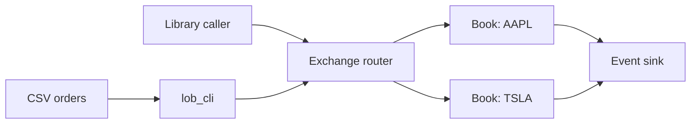
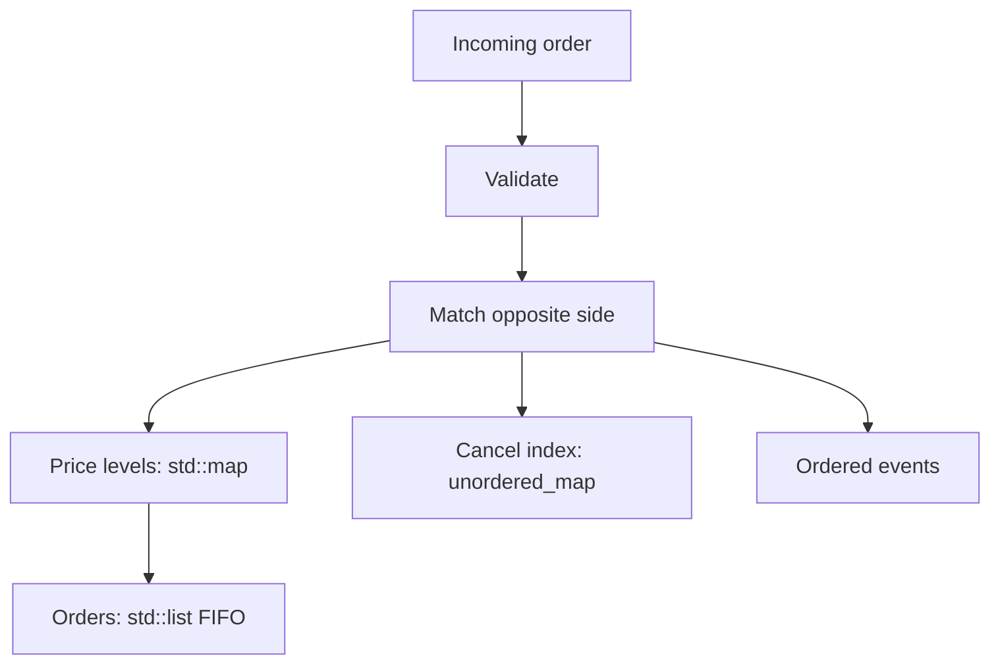

# Limit Order Book Matching Engine

**A C++17 matching engine that demonstrates price-time priority, multi-symbol routing, four order types, deterministic event output, and reproducible submit-latency measurement.**

[](https://sonarcloud.io/summary/new_code?id=aariiparekh3012-collab_the-book-was-open)
[](CMakeLists.txt)
[](LICENSE)

## 1. Purpose

The project models the core mechanics of a central limit order book: accepting, matching, cancelling and routing orders while preserving price priority and FIFO ordering within each price level.

Implemented behavior:

- Limit, market, immediate-or-cancel (IOC), and fill-or-kill (FOK) orders
- Price-time priority and execution at the resting order's price
- Partial fills and sweeps across multiple price levels
- Per-symbol books behind an `Exchange` router
- Integer prices and quantities; no floating-point arithmetic in the core
- Ordered `ACK`, `TRADE`, `FILLED`, `PARTIAL`, `CANCEL_ACK`, and `REJECT` events
- CSV-driven command-line demonstration

## 2. Terminal demonstration

The included sample order flow is executable:

```bash
./build/lob_cli examples/sample_orders.csv
```

Excerpt from a verified run:

```text
LIMIT SELL AAPL id=5 px=15000 qty=50
  ACK        id=5
  TRADE      agg=5 rest=1 px=15000 qty=50
  FILLED     id=5
  [AAPL] bid=15000x50 | ask=15100x150

IOC SELL AAPL id=7 px=14800 qty=500
  TRADE      agg=7 rest=1 px=15000 qty=50
  TRADE      agg=7 rest=2 px=14900 qty=200
  PARTIAL    id=7 rem=250
  CANCEL_ACK id=7
```

This demonstrates execution against the best available prices, partial fills, and cancellation of an IOC remainder.

## 3. Architecture



Within each `Book`:



See [DESIGN.md](DESIGN.md) for the invariants and public API.

## 4. Build and run

### Requirements

- CMake 3.16 or newer
- A C++17 compiler
- Git access during the first configuration so CMake can fetch Catch2 3.7.1

```bash
git clone https://github.com/aariiparekh3012-collab/the-book-was-open.git
cd the-book-was-open

cmake -S . -B build -DCMAKE_BUILD_TYPE=Release
cmake --build build -j

# Run the example order flow
./build/lob_cli examples/sample_orders.csv

# Run the benchmark
./build/bench_submit
```

The CLI can also read CSV input from standard input:

```bash
./build/lob_cli - < examples/sample_orders.csv
```

Input rows use `id,symbol,side,type,price,qty`; cancellation rows use `CANCEL,order_id`.

## 5. Methodology

### Matching

- Bids use `std::map<Price, Queue, std::greater<Price>>`; asks use ascending `std::map` order.
- Each price level owns a `std::list` of resting orders, preserving stable FIFO order.
- An `unordered_map<OrderId, iterator>` supports average O(1) lookup for cancellation inside a book.
- Market orders ignore the price constraint and never rest.
- IOC orders match immediately and cancel any remaining quantity.
- FOK orders first walk eligible liquidity without mutation; the order is rejected unless the entire quantity is available.

### Correctness invariants

The implementation and tests exercise four core invariants:

1. No crossed book remains after processing.
2. Orders at the same price execute FIFO.
3. Better-priced liquidity cannot be skipped.
4. Submitted quantity is accounted for as matched, resting, or cancelled.

### Benchmark

`bench/bench_submit.cpp` generates 1,010,000 deterministic random limit orders with seed `42`, uses the first 10,000 as warm-up, and measures the next 1,000,000 individual `Book::submit` calls with `std::chrono::steady_clock`. Order generation and vector allocation occur before timing; emitted events are consumed by a no-op sink.

## 6. Reproducible results

Verified on 28 August 2026 using a release build with GCC 13.3 on Linux x86-64 and an Intel Xeon Platinum 8370C virtual CPU:

```text
submit benchmark (1000000 orders, 10000 warmup)
  p50:   198 ns
  p90:   585 ns
  p99:   1254 ns
  p99.9: 18633 ns
  max:   47668111 ns
  avg:   504 ns
  throughput: 1983156 orders/sec
```

These are local microbenchmark results, not exchange-to-exchange or network latency. Run `./build/bench_submit` on the target machine and report the compiler, flags, CPU, operating system, order distribution, warm-up count, and percentile statistics with any comparison.

## 7. Testing

```bash
cmake -S . -B build -DCMAKE_BUILD_TYPE=Release
cmake --build build -j
ctest --test-dir build --output-on-failure
```

Verified result:

```text
100% tests passed, 0 tests failed out of 31
```

The suite covers resting orders, exact and partial crosses, FIFO, price priority, multi-level sweeps, market/IOC/FOK behavior, cancellation, invalid inputs, top-of-book state, and multi-symbol routing.

## 8. Limitations and unfinished work

- Single-threaded and entirely in memory; no concurrency model or recovery log
- Uses node-based standard-library containers rather than cache-optimized price-level storage
- No networking, binary protocol, sequencing, snapshots, or replay implementation
- No modify/replace instruction, stop orders, iceberg orders, auctions, or pegged orders
- No self-trade prevention, pre-trade risk checks, fees, positions, or credit limits
- `Exchange::cancel` scans books; it does not maintain a global order-to-symbol index
- Benchmark measures one synthetic distribution and includes clock-call overhead and host scheduling noise
- The event stream is emitted synchronously, but persistent event sourcing and state reconstruction are not implemented

## Repository structure

```text
include/lob/               Public types, events, book and exchange interfaces
src/book.cpp               Matching and cancellation implementation
tools/lob_cli.cpp          CSV-to-event-log demonstration
examples/sample_orders.csv Reproducible example flow
bench/bench_submit.cpp     Deterministic latency microbenchmark
tests/test_matching.cpp    Catch2 correctness tests
DESIGN.md                  Data structures, invariants and extension notes
```

## License

[MIT](LICENSE)
